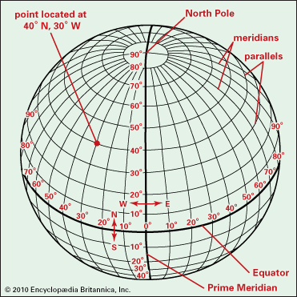
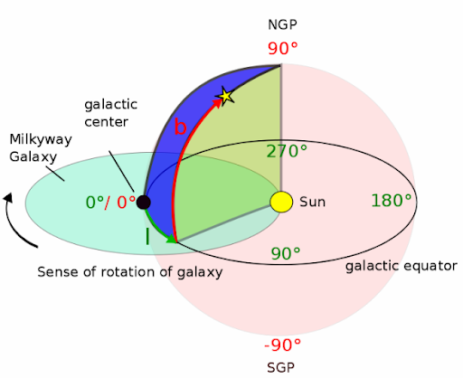

# Ex-Orb
An interactive planetary map of NASA's exoplanet data.

## Process
This project was my first foray into using Angular, in place of React, and also my first deployment to Azure. Before even starting, I had to learn how to make a containerized app in Docker. Once I wrestled with the config, CI/CD, and deploying the app as a container, the real work could begin.

The app fetches data from NASA's Exoplanet API. I wanted to make an app that splashes all the systems onto a map, then when you click on a star system, it displays all the planets rotating around its host star. This is where I want into the largest hurdle: it turns out celestial latitude and longitude is different than terrestrial latitude and longitude. 

### Terrestrial Lat / Long

### Celestial Lat / Long

As you can see, there are a few differences. For one, the boundaries are different. Terrestrial Lat / Long ranges from 0 to 90 degrees. Celestial Latitude ranges from 0 to 360 degrees, and its Longitude ranges from -90 to 90 degrees. I had found a formula that translates the Earth-based Latitude and Longitude to a 2D surface, but there was no such formula for celestial coordinates. I had to jerry-rig the formula to account for squishing more data into a 2D space. These celestial measurements were meant to account for every celestial body moving throughout the sky, whereas terrestrial lat / long never moves. 

A way to imagine it is this: you're on Earth, trying to show on a 2D map where Los Angeles is. Except Los Angeles is now hundreds of miles under the Earth, and it orbits around a point that isn't the earth's core. Sounds kind of complicated, right?

Eventually I settled on a jerry-rigged formula that plotted planets at a fixed position, and squished it into a 2D mapping. This ran into another problem:

We all know that plotting terrestrial latitude and longitude distorts the data when put onto a 2D map. The same things happens with celestial coordinates, but far, far greater. In order to 'accurately' place the points on a map of the Milky Way, I would need an image of the Milky Way that was flattened and warped to fit into a 2D square. Luckily for me, NASA had a great image of what the Milky Way looks like with these constraints.

Once I had the warped map of the Milky Way, I ran the app, and to my surprise, the planets popped in place exactly where they should be. With the hard part done, I moved onto programming the app's interaction.

This was also my first foray into animation. I initially tried and failed to animate an HTML canvas - I learned the hard way that a canvas can't be interacted with once its made. This meant I had to learn animating with SVGs, because I needed the user to interact with each individual planet. After a lot of trial and error, I settled on the SVG animation suite GreenSock: https://greensock.com/docs/

Using a viewBox that zooms in and out, and rotation animations for planetary orbits, I had a snappy map that could zoom in and out, then display the rotating planets around their host stars. I even added the ability to click on the planets to display their orbital times and masses.

## Outcome

As of right now, 10/15/2020, I'm content leaving Ex-Orb where it is until my next round of interviews are over. I have a nice app that plays around with large datasets, which showcases my ability to use Angular, SVG animations, and setting up a deplopyment to Azure with Docker. In the future, once my next round of interviews are over, I plan on implementing a C# backend that allows users to save their favorite planets and give them nicknames.

I'm very proud of this as my first solo project. I hope to eventually turn it into a multiplayer strategy game, so here's hoping I can work on it again soon.

